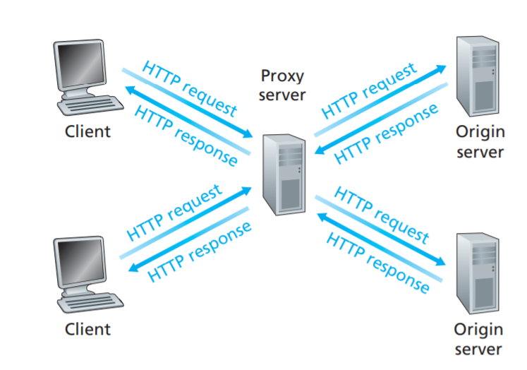

# Chapter 1 计算机网络和因特网

## 网络边缘

### 物理媒介

分为两类：导引型（guided media），非导引型（unguided media）

- 双绞铜线（Twisted-Pair Copper Wire）
- 同轴电缆（Coaxial Cable）
- 光纤（Fiber Optics）
- 陆地无线电信道（Terrestrial Radio Channels）
- 卫星无线电信道（Satellite Radio Channel）

## 网络核心

> the mesh of packet switches and links that interconnects the Internet’s end systems

###  Packet Switching 分组交换

> breaks **long messages** into smaller chunks of data known as **packets**. Between source and destination, each packet travels through **communication links** and **packet switches** (for which there are two predominant types, routers and linklayer switches)
>
> Packets are transmitted over each communication link at a rate equal to the **full transmission rate of the link.**

a) Store-and-Forward Transmission 存储转发传输

Store-and-forward transmission means that the packet switch **must receive the entire packet before it can begin to transmit the first bit of the packet** onto the outbound link.

P个分组经过N条链路，每一个分组大小是L，速率为R

端到端的时延是：(N + P - 1)*(L/R)

b) Queuing Delays and Packet Loss

Packet Swith have a **output buffer(output queue),** which stores packets that the router is about to send into that link. In addition to the **store-and-forward delays**, packets suffer output buffer **queuing delays**. When the output buffer is full, **packet loss** will occur.

c) Forwarding Tables and Routing Protocols

each router has a **forwarding table** （转发表）that maps destination addresses (or portions of the destination addresses) to that router’s outbound links.

### A Network of Networks

- ISP: 互联网服务提供商
- IXP： Internet Exchange Point 因特网交换点 保证同级ISP对等（peering）
- content provider networks：内容提供商网络

## Delay, Loss, and Throughput

### Types Of Delay

- **nodal processing delay**（节点处理时延）:

  The time required to **examine the packet’s header** and **determine where to direct the packet** is part of the processing delay.

- **Queuing Delay**（排队时延）：

  At the queue, the packet experiences a queuing delay as it waits to be transmitted onto the link.

- **Transmission Delay**（传输时延）：

  Denote the length of the packet by L bits, and denote the transmission rate of the link from router A to router B by R bits/sec. The transmission delay is L/R

- **Propagation Delay**（传播时延）：

  Once a bit is pushed into the link, it needs to propagate to router B. The time required to propagate from the beginning of the link to router B is the propagation delay

### Queuing Delay and Packet Loss

- **traffic intensity**（流量强度): let *a* denote the **average rate at which packets** arrive at the queue (*a* is in units of packets/sec)（包到达平均速度）Recall that R is the transmission rate（传输速度）; Also suppose, for simplicity, that all packets consist of L bits. Then the average rate at which bits arrive at the queue is *La* bits/sec（包到达路由平均速度） The ratio *La/R*, called the traffic intensity. 保证流量强度<=1才能正常工作
- **Packet Loss**（丢包）：With no place to store such a packet, a router will drop that packet; that is, the packet will be lost.

### End-to-End Delay

suppose there are **N - 1** routers between the source host and the destination host

$d_{end-end} = N(d_{proc} +d_{trans} + d_{prop})$

### Throughput in Computer Networks

- **instantaneous throughput**:at any instant of time is the rate (in bits/sec) at which Host B is receiving the file
- **average throughput**: For all file
- the **throughput** depends not only on the transmission rates of the links along the path, but also on the intervening traffic

## Protocol Layers and Their Service Models

### Layered Architecture

> Protocol layering has conceptual and structural advantages
>
> the protocols of the various layers are called the **protocol stack**

Five-layer Internet protocol stack:

1. **Application Layer**: HTTP

   The application layer is where **network applications and their application-layer protocols** reside. this packet of information at the application layer as a **message**（报文）.

2. **Transport Layer**：TCP UDP

   The Internet’s transport layer transports application-layer messages between application endpoints. Transport-layer packet as a **segment**(报文段).

   TCP guaranteed delivery of application-layer messages to the destination and flow control (that is, sender/receiver speed matching) But UDP not.

3. **Network Layer**：IP

   The Internet’s network layer is responsible for moving network-layer packets known as **datagrams** (数据报)from one host to another.

4. **Link Layer**:

   To move a packet from one node (host or router) to the next node in the route, the network layer relies on the services of the link layer. The services provided by the link layer depend on the **specific link-layer protocol**(特定链路层协议) that is employed over the link. refer to the linklayer packets as **frames.**（帧）

5. **Physical Layer**：

   the job of the physical layer is to **move the individual bits** within the frame from one node to the next.

**OSI Model**：

> There are application layer, presentation layer, session layer, transport layer, network layer, data link layer, and physical layer from up to down.

- **presentation layer** is to provide services that allow communicating applications to interpret the meaning of data exchanged. These services include **data compression** and **data encryption** as well as **data description**.
- **The session layer** provides for **delimiting and synchronization of data exchange**(数据交换和定界), including the means to build a checkpointing and recovery scheme.

### Encapsulation

we see that at each layer, a packet has two types of fields: **header fields**（首部字段） and a **payload field**（有效载荷字段）. The payload is typically a packet from the layer above.

In every layer, the layer encapsulates the data from last layer as payload field, then add its own header information, to build whole information.

# Chapter 2 Application Layer

> 2.2 2.5 2.6 are important
>
> DNS protocol not important
>
> 2.3 2.4-

## Principles of Network Applications

### Network Application Architectures

> two major architectural paradigms used in modern network applications: the client-server architecture or the peer-to-peer (P2P) architecture

- **the client-server architecture：**

  client and server are separate and fixed, and they perform they own functions

- **P2P architecture:**

  Because the peers（对等方） communicate without passing through a dedicated（专用的） server, the architecture is called peer-to-peer. These peers can be server also can be clientz.

  P2P is **self-scalability and cost effective**. And have three **challenges**: ISP Friendly, Security, Incentives（激励）.

### Processes Communicating

> In truth, server and client are just two process

A process sends messages into, and receives messages from, the network through a software interface called a socket（套接字）. It is also referred to as the Application Programming Interface (API) between the application and the network

We use **IP address and port number** to do addressing process.

### Transport Services Available to Applications

- Reliable Data Transfer
- Throughput
- Timing
- Security

### Transport Services Provided by the Internet

- TCP Servies

  Connection-oriented service and Reliable data transfer service

- UDP

  UDP is a no-frills, lightweight transport protocol, providing minimal services. UDP is **connectionless, unreliable**. UDP provides **no guarantee** that the message will ever reach the receiving process. Furthermore, messages that do arrive at the receiving process may arrive **out of order**. And no congestion-control mechanism（拥塞机制）.

### Services Not Provided by Internet Transport Protocols

But in our brief description of TCP and UDP, conspicuously（明显的） missing was any mention of throughput or timing guarantees—services not provided by today’s Internet transport protocols.

## The Web and HTTP

###  Overview of HTTP

The **HyperText Transfer Protocol (HTTP)**, the Web’s application-layer protocol, is at the heart of the Web. . Because an HTTP server maintains no information about the clients, HTTP is said to be a **stateless protocol**（无状态协议）. We also remark that the **Web uses the client-server application architecture,**

### Non-Persistent and Persistent Connections

> Attention: 对多并发的例子中，线程之间对其他线程的连接一般是不可见的
>
> 流水线式不一定是绝对好的，本质是提高链路的利用率（充分利用带宽时延积）
>
> 先获取HTML然后在获取其它对象
>
> 1. 可能会因为头包过大造成链路阻塞
> 2. 返回必须按照接收顺序，已处理好的必须等前一个发送后才可以发送

- **non-persistent connections**: each request/response pair be sent over a separate TCP connection
- **persistent connections**: all of the requests and their corresponding responses be sent over the same TCP connection，注意持久化一般是流水线

**round-trip time (RTT 往返时延)**：the time it takes for a small packet to travel from client to server and then back to the client

**the total response time:(总响应时间)** two RTTs plus the transmission time at the server of the HTML file.

Non-persistent connections have some **shortcomings**.

- a brand-new connection must be established and maintained for each requested object.
- each object suffers a delivery delay of two RTTs

### HTTP Message Format

1. HTTP Request Message

   - request line（请求行）: first line
     - method field: **GET, POST**, HEAD, PUT, and DELETE
     - URL field
     - HTTP Version field
   - header line（首部行）: subsequent line
     - Host : specifies the host on which the object resides
     - Connection : whether use persistent connections
     - User-agent : specifies the user agent , that is, the browser type. This header line is useful because the server can actually send different versions of the same object to different types of user agents.
     - Accept-language: indicates that the user prefers language version
     - POST method: has an entity body for post data, but get also can do use work with saving data in URLs.

2. HTTP Response Message

   - status line : first line

     version + status code + phrase

     - 200 OK : succeeded
     - 301 Moved Permanently : Requested object has been permanently moved and new URL will be returned
     - 400 Bad Request : the request could not be understood by the server.
     - 404 Not Found : The requested document does not exist on this server
     - 505 HTTP Version Not Supported : ~~~

   - header line: subsequent line :

     - Connection : tell the client that whether close the TCP connection after sending the message
     - Date : **indicates the time and date when the HTTP response was created and sent by the server**. Note that this is not the time when the object was created or last modified; it is the time when the server retrieves the object from its file system, inserts the object into the response message, and sends the response message.
     - Server : analogous to the User-agent
     - Last-Modified : the time and date when the object was created or last modified
     - Content-Length : data size
     - Content-Type : data type such as HTML

   - entity body : save data

### User-Server Interaction: Cookies

> cookies allow sites to keep track of users

Cookie has four components:

1. a cookie header line in the HTTP **response** message
2. a cookie header line in the HTTP **request** message
3. a cookie file kept on the user’s end system and managed by the user’s **browser**
4. a back-end database at **the Web site**

Although cookies often simplify the Internet shopping experience for the user, they are controversial because they can also be considered as an invasion of privacy

### Web Caching

> A Web cache—also called a proxy server（代理服务器）—is a network entity that satisfies HTTP requests on the behalf of an origin Web server

It works like this:

Note that a cache is ***both a server and a client\*** at the same time.

Advantages:

- ***A Web cache can substantially reduce the response time for a client request\***, particularly if the bottleneck bandwidth between the client and the origin server is much less than the bottleneck bandwidth between the client and the cache （加速）
- Web caches can substantially reduce traffic on an institution’s access link to the Internet. So they does not have to upgrade bandwidth as quickly, thereby reducing costs. （减少通信量降低带宽不耗钱）
- Web caches can substantially reduce Web traffic in the Internet as a whole, thereby improving performance for all applications. （降低网络流量，提高性能）

**Content Distribution Networks (CDNs)** （内容分发网络）: A CDN company installs many geographically distributed caches throughout the Internet, thereby localizing much of the traffic.

### The Conditional GET

> - the request message uses the GET method
> - the request message includes an **If-ModifiedSince**: header line

Use the conditional get to guarantee the file in proxy server is up to date.

##   Placeholder

##   Placeholder

## DNS—The Internet’s Directory Service

> domain name system: a directory service that translates hostnames to IP addresses 53端口

Definition:

1. a distributed database implemented in a hierarchy of DNS servers
2. an application-layer protocol that allows hosts to query the distributed database

### Services Provided by DNS

- Host aliasing
- Mail server aliasing
- Load distribution（负载分配）（一个域名对应多个服务器IP）

### Overview of How DNS Works

- centralized design: A simple design for DNS would have one DNS server that contains all the mappings
  - A single point of failure
  - Traffic volume
  - Distant centralized database
  - Maintenance
- distributed hierarchical design: uses a large number of servers, organized in a hierarchical fashion and distributed around the world
  - root DNS servers : In the Internet there are 13 root DNS servers
  - top-level domain (TLD) servers
  - authoritative DNS servers（权威域名服务器）: Every organization with publicly accessible hosts (such as Web servers and mail servers) on the Internet must provide publicly accessible DNS records that map the names of those hosts to IP addresses
  - local DNS server : A local DNS server does not strictly belong to the hierarchy of servers but is nevertheless central to the DNS architecture; When a host makes a DNS query, the query is sent to the local DNS server, which acts a proxy.
    - recursive：如果全部采用这种方式会给更服务器极大的压力
    - iterative

### DNS Records and Messages

resource records (RRs): provide hostname-to-IP address mappings

**format : (Name, Value, Type, TTL)**

- Type = A : Name is a hostname and Value is the IP address for the hostname.
- Type = NS : Name is a domain (such as foo.com) and Value is the hostname of an authoritative DNS server that knows how to obtain the IP addresses for hosts in the domain
- Type = CNAME : Value is a canonical hostname for the alias hostname Name
- Type = MX : Value is the canonical name of a mail server that has an alias hostname Name

# Chapter 3 Transport Layer

> A transport-layer protocol provides for **logical communication** between application ***processes\*** running on different hosts.
>
> 3.6 不做要求

# Reference:

1. https://weijun-lin.top/2020/03/02/2020-03-02-Compute-Networking-A-Top-Down-Approach-6th/

